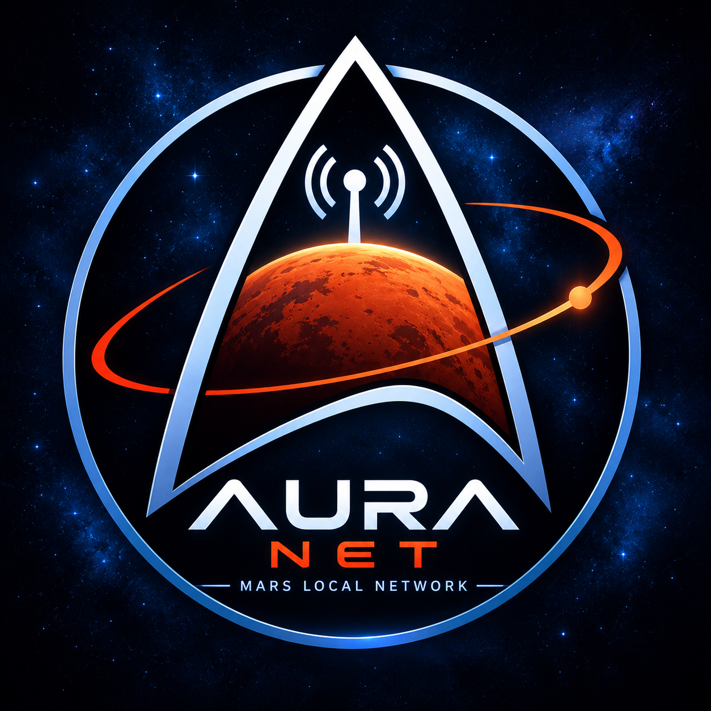

# AuraNet 🔴

  

  <strong>An autonomous, local communication network for the first Mars settlers.</strong> 
  Infrastructure powered by Rust, Raspberry Pi, and LoRaWAN.

---

## 🚧 Project Status: Planned / Work in Progress (WIP)

> **NOTE:** 🚀 **AuraNet is currently in the conceptual phase.** 
> Active development is scheduled to kick off in **November 2026** with initial hardware prototypes (Raspberry Pi). The project is temporarily on hold while the current focus is dedicated to low-level hardware programming fundamentals.

---

## 🛰️ About AuraNet

**AuraNet** is the prototype of a purely **local mesh communication network**, specifically engineered for the unique environmental conditions and infrastructure demands of early Martian settlements. The system operates entirely independently of orbital satellites or any direct connection to Earth. 

It is designed to serve as a robust transport layer (via **LoRaWAN & Rust**) for autonomous AI agents originating from the **AgentHub** project (built on OpenClaw). More information will be available later at [digitalcompass.site/auranet](https://digitalcompass.site).

---

## 🛠️ Planned Tech Stack

*   **Programming Language:** Rust (for maximum stability, performance, and memory safety)
*   **Hardware:** Raspberry Pi (a hybrid ecosystem of Pi Pico, ESP32 and larger single-board instances)
*   **Protocol:** LoRaWAN (low-power, long-range data transmission optimized for Martian topography)

---

## 🗺️ Initial Milestones (Starting Nov 2026)

- [x] **Branding & Concept:** Star Trek-inspired logo designed, technical framework established.
- [ ] **Phase 1 (Nov 2026):** "Baby Steps" in Rust on Raspberry Pi hardware (Local P2P ping tests via LoRa).
- [ ] **Phase 2 (Jan 2027):** Launch of the project subpage at `digitalcompass.site/auranet`, introducing the "Founder Merch Patch" (8cm woven Velcro patch with silver metallic threads to crowd-fund community test hardware).

---

  <em>AuraNet — Mars Local Network • Built for the future of interplanetary colonization.</em>

## 📄 Lizenz

This project is licensed under **Apache License 2.0**  – more under [LICENSE](LICENSE)-Doc for Details. 
